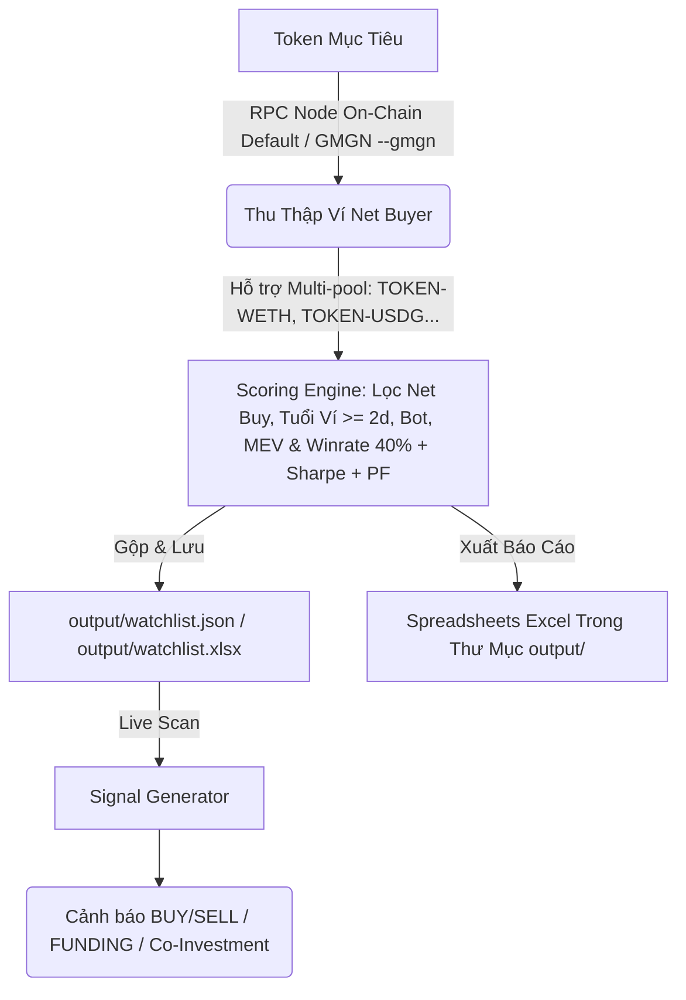

# rh-wallet-tracker-bot

Bot hỗ trợ quét và phát hiện các ví giao dịch hiệu quả (insiders, snipers, smart money) trên mạng lưới Robinhood Chain để tìm kiếm cơ hội đầu tư sớm.

---

## 1. Quy trình & Kiến trúc Hệ thống

Hệ thống hoạt động qua 3 phân hệ (subsystems) khép kín để phát hiện tín hiệu dòng tiền:

1. **Thu thập dữ liệu (Ingestion)**: 
   * Mặc định quét trực tiếp On-Chain từ RPC Node của Robinhood Chain để bắt 100% ví giao dịch trong khung giờ.
   * **Hỗ trợ Đa bể thanh khoản (Multi-pool Support)**: Tự động phát hiện và phân tích giao dịch swap trên **tất cả các pool** của token (ví dụ: TOKEN-WETH, TOKEN-USDG, TOKEN-NVDA) thay vì chỉ quét một pool chính có thanh khoản cao nhất.
   * Dùng tùy chọn `--gmgn` để khai thác cơ sở dữ liệu Top Traders của GMGN.
2. **Đánh giá & Lọc ví (Scoring Engine)**: 
   * Lọc ví **Net Buyer** (lượng mua > lượng bán) để chỉ giữ lại các ví gom hàng / holding trong khung giờ.
   * Lọc ví **Độ tuổi tối thiểu** (MIN_WALLET_AGE_DAYS >= 2.0) để loại bỏ các ví burner mới tạo xoay vòng tránh bị theo dấu.
   * Loại bỏ ví MEV/Sandwich (hold dưới 60s), lọc bot giao dịch (số lệnh > 300), áp dụng sàn winrate tối thiểu 40%, tính toán Max Drawdown, Profit Factor, Sharpe Ratio, và tự động truy vết ví mẹ cấp gas (`insider_funder`). Các ví đạt tiêu chuẩn được lưu vào `output/watchlist.json` và đồng bộ ra `output/watchlist.xlsx`.
3. **Phát tín hiệu (Signal Generator)**: Theo dõi danh sách ví trong watchlist để đưa ra cảnh báo giao dịch (`BUY/SELL`), cảnh báo ví mẹ cấp vốn cho ví con mới (`FUNDING`), và cảnh báo mua chung (`Co-Investment`).



---

## 2. Hướng dẫn Sử dụng & Phím tắt CLI Rút gọn

Hệ thống cung cấp ba phím tắt CLI thực thi trực tiếp từ bất kỳ thư mục nào:

### A. Phím tắt quét ví (`./scrap`)
Tìm kiếm và xếp hạng ví giao dịch dựa trên một token mẫu:
```bash
./scrap <SYMBOL/ADDRESS> [options]
```
* **Dịch ký hiệu tự động**: Bạn có thể truyền thẳng tên token (ví dụ: `pons`, `arrow`) thay vì địa chỉ ví contract dài.
* **Ví dụ**:
  ```bash
  # Quét on-chain mặc định tìm ví gom hàng/sniper của PONS trong 1 khung giờ cụ thể
  ./scrap pons --window "14/07 16:00" "14/07 20:30"
  ```

### B. Phím tắt theo dõi & phát tín hiệu (`./watch`)
Khởi chạy bot theo dõi trực tiếp các ví trong watchlist để phát tín hiệu giao dịch:
```bash
./watch [options]
```
* **Ví dụ**:
  ```bash
  ./watch --min-score 45 --export output/signals.xlsx
  ```

### C. Phím tắt xóa ví khỏi Watchlist (`./unwatch`)
Xóa thủ công một hoặc nhiều ví khỏi danh sách theo dõi và tự động đồng bộ hóa sang tệp Excel:
```bash
./unwatch <wallet_address_1> [wallet_address_2] ...
```
* **Ví dụ**:
  ```bash
  # Xóa 1 ví cụ thể khỏi danh sách theo dõi
  ./unwatch 0x368877976f012019125ee1dc7f18ad11cd900123
  ```

---

## 3. Các Tùy chọn Quét Ví (Scraper Options)
* *Mặc định*: Tự động quét 100% dữ liệu chuyển khoản trực tiếp On-chain qua RPC Node.
* `--gmgn`: Chuyển sang chế độ lấy dữ liệu Top Traders từ cơ sở dữ liệu GMGN thay vì quét trực tiếp on-chain.
* `--tag <tag>`: Lọc ví theo nhãn của GMGN (`rat_trader`, `smart_degen`, `sniper`) (dùng khi bật `--gmgn`).
* `--all`: Bỏ qua bộ lọc tag, lấy tất cả ví top traders của token từ GMGN.
* `--limit <n>`: Giới hạn số lượng ví tải về (mặc định: 50).
* `--tx-limit <n>`: Hạn mức số giao dịch độc nhất tối đa xử lý khi quét on-chain (mặc định: 2000).
* `--window <START> <END>`: Khung thời gian cụ thể (ví dụ: `"14/07 16:00" "14/07 17:00"`, hỗ trợ định dạng ngày tự động điền năm hiện tại).
* `--stats-period <7d|30d>`: Khoảng thời gian chấm điểm hiệu suất ví (mặc định: `30d`).
* `--export <path.xlsx>`: Xuất bảng tổng hợp xếp hạng ví ra file Excel (mặc định tự đặt theo token: `output/wallet_summary_<token>.xlsx`).
* `--txns <path.xlsx>`: Xuất chi tiết tất cả giao dịch ra Excel (mặc định tự đặt theo token: `output/transactions_<token>.xlsx`).
* `--watchlist <path.json>`: Đường dẫn lưu watchlist (mặc định: `output/watchlist.json`).

---

## 4. Cơ chế Chấm điểm & Bộ lọc Cứng

### A. Các bộ lọc cứng:
* **Lọc Ví Net Buyer**: Chỉ chấp nhận ví có lượng mua lớn hơn lượng bán (total_buy_tokens > total_sell_tokens) trong khung thời gian quét.
* **Lọc độ tuổi tối thiểu**: Chỉ chấp nhận ví hoạt động ít nhất 2 ngày (MIN_WALLET_AGE_DAYS >= 2.0) để loại bỏ ví burner/cycling.
* **Loại bỏ MEV/Sandwich**: Loại bỏ ví có tag `sandwich_bot` hoặc thời gian nắm giữ trung bình dưới 60 giây.
* **Lọc Bot giao dịch**: Loại bỏ các ví thực hiện **trên 500 giao dịch** (`MAX_TX_COUNT = 500`) trong 30 ngày.
* **Sàn Win Rate**: Yêu cầu tỉ lệ thắng lịch sử tối thiểu **40%** (`MIN_WINRATE = 0.40`).
* **Sàn Max Drawdown**: Loại bỏ ví có mức độ sụt giảm từ đỉnh tài sản vượt quá **60%** (`MAX_DRAWDOWN_RATIO_LIMIT = 0.60`).
* **Ví mới (Fresh Wallet)**: Ưu tiên giữ lại để chấm điểm sớm, đồng thời tự động truy vết ví chính cấp gas để gán nhãn `insider_funder`.

### B. Công thức Trọng số Điểm Composite mới (Tổng 100 điểm):

| Chỉ số thành phần | Trọng số |
| :--- | :---: |
| **Win Rate** | 10% |
| **PnL Ratio (ROI)** | 15% |
| **Profit** | 15% |
| **Trading Volume** | 10% |
| **Profit Factor** | 15% |
| **Sharpe Ratio** | 15% |
| **Max Drawdown** | 10% |
| **Moonshot** | 10% |

---

## 5. Đầu ra Spreadsheet Excel

Sau khi chạy xong lệnh quét `./scrap`, hệ thống tự động xuất các tệp Excel sau vào thư mục `output/` và kích hoạt ứng dụng bảng tính trên màn hình để bạn kiểm toán ngay:
1. **`output/transactions_<token>.xlsx`** (ví dụ `output/transactions_pons.xlsx`): Chứa tab giao dịch sạch và tab "Raw Transactions" kiểm toán toàn bộ sự kiện thô (MEV, status). Tự động gộp dữ liệu nếu quét nhiều lần.
2. **`output/wallet_summary_<token>.xlsx`** (ví dụ `output/wallet_summary_pons.xlsx`): Bảng xếp hạng chi tiết các ví gom hàng dự án này.
3. **`output/watchlist.xlsx`**: Tệp xuất danh sách theo dõi Master chứa các ví uy tín nhất (>= 40 điểm), với cột `Seed Tokens` hiển thị tên Token trực quan (`PONS`, `NOCK`, `WALLET`...).
