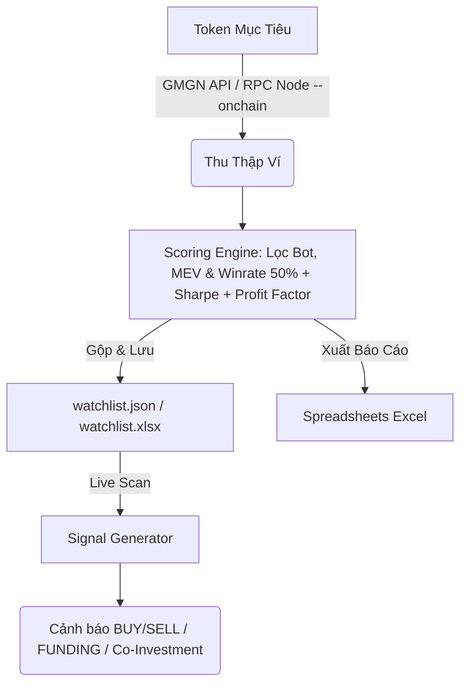

# rh-wallet-tracker-bot

Bot hỗ trợ quét và phát hiện các ví giao dịch hiệu quả (insiders, snipers, smart money) trên mạng lưới Robinhood Chain để tìm kiếm cơ hội đầu tư sớm.

---

## 1. Quy trình & Kiến trúc Hệ thống

Hệ thống hoạt động qua 3 phân hệ (subsystems) khép kín để phát hiện tín hiệu dòng tiền:

1.  **Thu thập dữ liệu (Ingestion)**: Quét ví qua GMGN (mặc định) để lấy danh sách Smart Money, hoặc quét trực tiếp On-chain (`--onchain`) sử dụng RPC Node để tìm các ví Snipers tại thời điểm launch/spike.
2.  **Đánh giá & Lọc ví (Scoring Engine)**: Loại bỏ các ví MEV/Sandwich (hold dưới 60s), lọc bot giao dịch (số lệnh > 300), áp dụng sàn winrate tối thiểu 50%, tính toán Max Drawdown, Profit Factor, Sharpe Ratio, và tự động truy vết ví mẹ cấp gas (`insider_funder`). Các ví đạt tiêu chuẩn được lưu vào `watchlist.json` và đồng bộ ra `watchlist.xlsx`.
3.  **Phát tín hiệu (Signal Generator)**: Theo dõi danh sách ví trong watchlist để đưa ra cảnh báo giao dịch (`BUY/SELL`), cảnh báo ví mẹ cấp vốn cho ví con mới (`FUNDING`), và cảnh báo mua chung (`Co-Investment`).



---

## 2. Hướng dẫn Sử dụng & Phím tắt CLI Rút gọn

Hệ thống cung cấp hai phím tắt CLI thực thi trực tiếp từ bất kỳ thư mục nào:

### A. Phím tắt quét ví (`./scrap`)
Tìm kiếm và xếp hạng ví giao dịch dựa trên một token mẫu:
```bash
./scrap <SYMBOL/ADDRESS> [options]
```
*   **Dịch ký hiệu tự động**: Bạn có thể truyền thẳng tên token (ví dụ: `pons`, `arrow`) thay vì địa chỉ ví contract dài.
*   **Ví dụ**:
    ```bash
    # Quét on-chain tìm ví sniper của PONS trong 1 khung giờ cụ thể và tự động mở báo cáo
    ./scrap pons --window "14/07 16:00" "14/07 20:30" --onchain
    ```

### B. Phím tắt theo dõi & phát tín hiệu (`./watch`)
Khởi chạy bot theo dõi trực tiếp các ví trong watchlist để phát tín hiệu giao dịch:
```bash
./watch [options]
```
*   **Ví dụ**:
    ```bash
    ./watch --min-score 45 --export signals.xlsx
    ```

---

## 3. Các Tùy chọn Quét Ví (Scraper Options)
*   `--tag <tag>`: Lọc ví theo nhãn của GMGN (`rat_trader`, `smart_degen`, `sniper`).
*   `--all`: Bỏ qua bộ lọc tag, lấy tất cả ví top traders của token.
*   `--limit <n>`: Giới hạn số lượng ví tải về (mặc định: 50).
*   `--onchain`: Bật chế độ quét trực tiếp dữ liệu chuyển khoản trên RPC Node (bắt ví sniper khi launch).
*   `--window <START> <END>`: Khung thời gian cụ thể (ví dụ: `"14/07 16:00" "14/07 17:00"`, hỗ trợ định dạng ngày tự động điền năm hiện tại).
*   `--stats-period <7d|30d>`: Khoảng thời gian chấm điểm hiệu suất ví (mặc định: `30d`).
*   `--export <path.xlsx>`: Xuất bảng tổng hợp xếp hạng ví ra file Excel.
*   `--txns <path.xlsx>`: Xuất chi tiết tất cả giao dịch ra Excel (chứa cả tab Clean và Raw Transactions).
*   `--watchlist <path.json>`: Đường dẫn lưu watchlist (mặc định: `watchlist.json`).

---

## 4. Cơ chế Chấm điểm & Bộ lọc Cứng (Hedge-Fund Level Scorer)

### A. Các bộ lọc cứng (Gatekeeper Filters):
*   **Loại bỏ MEV/Sandwich**: Loại bỏ ví có tag `sandwich_bot` hoặc thời gian nắm giữ trung bình dưới 60 giây.
*   **Lọc Bot giao dịch**: Loại bỏ các ví thực hiện **trên 300 giao dịch** (`MAX_TX_COUNT = 300`) trong 30 ngày.
*   **Sàn Win Rate**: Yêu cầu tỉ lệ thắng lịch sử tối thiểu **50%** (`MIN_WINRATE = 0.50`).
*   **Sàn Max Drawdown**: Loại bỏ ví có mức độ sụt giảm từ đỉnh tài sản vượt quá **60%** (`MAX_DRAWDOWN_RATIO_LIMIT = 0.60`).
*   **Ví mới (Fresh Wallet)**: Ví có nhãn `fresh_wallet` được ưu tiên giữ lại để chấm điểm sớm, đồng thời tự động truy vết ví chính đã chuyển gas cho nó để gán nhãn `insider_funder`.

### B. Công thức Trọng số Điểm Composite mới (SCORE_WEIGHTS - Tổng 100 điểm):

| Chỉ số thành phần | Trọng số | Công thức chuẩn hóa (Dải 0..1) |
| :--- | :---: | :--- |
| **Win Rate** | 10% | $\text{Clamp}_0^1(\text{winrate})$ |
| **PnL Ratio (ROI)** | 10% | $\text{Clamp}_0^1(\text{pnl-ratio} / 3.0)$ |
| **Profit** | 15% | $\text{Clamp}_0^1(\log_{10}(\text{profit}) / 5.0)$ |
| **Trading Volume** | 10% | $\text{Clamp}_0^1(\log_{10}(\text{volume}) / \log_{10}(200,000))$ |
| **Profit Factor** | 15% | $\text{Clamp}_0^1(\text{profit-factor} / 2.0)$ |
| **Sharpe Ratio** | 10% | $\text{Clamp}_0^1(\text{sharpe-ratio} / 1.5)$ |
| **Max Drawdown** | 10% | $\text{Clamp}_0^1(1.0 - \text{drawdown-ratio})$ |
| **Moonshot** | 10% | $\text{Clamp}_0^1(\text{moonshot-count} / \text{token-num})$ |
| **Experience** | 10% | $\text{Clamp}_0^1(\text{token-num} / 30)$ |

---

## 5. Đầu ra Spreadsheet Excel (Tự động mở khi hoàn tất)

Sau khi chạy xong lệnh quét `./scrap`, hệ thống tự động xuất các tệp Excel sau và kích hoạt ứng dụng bảng tính trên màn hình để bạn kiểm toán ngay:
1.  **[transactions.xlsx](file:///Users/leminhhieu/github/rh-wallet-tracker-bot/transactions.xlsx)**: Chứa tab giao dịch sạch, PnL riêng biệt của từng ví, và tab "Raw Transactions" kiểm toán toàn bộ sự kiện thô (MEV, spam).
2.  **[wallet_summary.xlsx](file:///Users/leminhhieu/github/rh-wallet-tracker-bot/wallet_summary.xlsx)**: Bảng xếp hạng chi tiết các ví giao dịch dự án này.
3.  **[watchlist.xlsx](file:///Users/leminhhieu/github/rh-wallet-tracker-bot/watchlist.xlsx)**: Tệp xuất danh sách theo dõi Master chứa đầy đủ các chỉ số nâng cao (Volume, Sharpe, Profit Factor, Max Drawdown).
