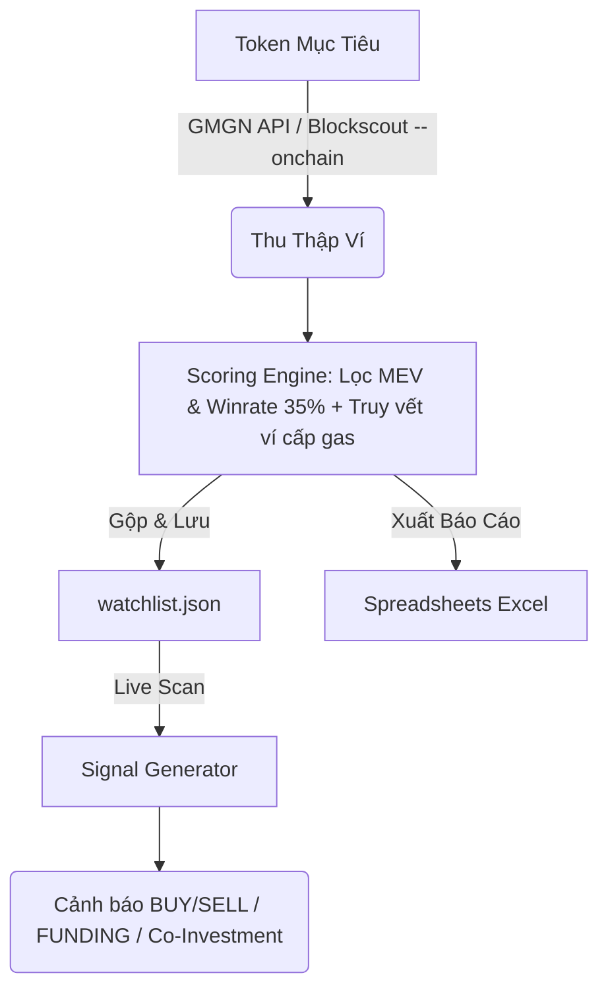

# rh-wallet-tracker-bot

Bot hỗ trợ quét và phát hiện các ví giao dịch hiệu quả (insiders, snipers, smart money) trên mạng lưới Robinhood Chain để tìm kiếm cơ hội đầu tư sớm.

---

## Tổng quan & Quy trình hệ thống

Hệ thống hoạt động qua 3 phân hệ (subsystems) khép kín để phát hiện tín hiệu dòng tiền:

1.  **Thu thập dữ liệu (Ingestion)**: Quét ví qua GMGN (mặc định) để lấy danh sách Smart Money, hoặc quét trực tiếp On-chain (`--onchain`) từ Blockscout để tìm các ví Snipers tại thời điểm launch/spike.
2.  **Đánh giá & Lọc ví (Scoring Engine)**: Loại bỏ các ví MEV/Sandwich (hold dưới 60s), áp dụng sàn winrate tối thiểu 35%, ưu tiên ví mới (`fresh_wallet`) và tự động truy vết ví mẹ cấp gas (`insider_funder`). Các ví đạt tiêu chuẩn được lưu vào `watchlist.json`.
3.  **Phát tín hiệu (Signal Generator)**: Theo dõi danh sách ví trong watchlist để đưa ra cảnh báo giao dịch (`BUY/SELL`), cảnh báo ví mẹ cấp vốn cho ví con mới (`FUNDING`), và cảnh báo mua chung (`Co-Investment`).



---

## Hướng dẫn sử dụng

### 1. Cài đặt & Cấu hình

Cài đặt thư viện:
```bash
pip install -r requirements.txt
```

Tạo file `.env` ở thư mục gốc của dự án:
```
GMGN_API_KEY=your_gmgn_api_key_here
BLOCKSCOUT_API_KEY=your_blockscout_api_key_here
```

### 2. Tìm kiếm ví (Scraper Path)

Chạy lệnh để tìm kiếm và xếp hạng ví giao dịch dựa trên một token mẫu:
```bash
python3 main.py <TOKEN_ADDRESS> [options]
```

#### Các tùy chọn chính:
*   `--tag <tag>`: Lọc ví theo nhãn của GMGN (`rat_trader`, `smart_degen`, `sniper`).
*   `--all`: Bỏ qua bộ lọc tag, lấy tất cả ví top traders của token.
*   `--limit <n>`: Giới hạn số lượng ví tải về (mặc định: 50).
*   `--onchain`: Bật chế độ quét trực tiếp dữ liệu chuyển khoản trên Blockscout (bắt ví sniper khi launch).
*   `--from <datetime>` / `--to <datetime>`: Giới hạn khoảng thời gian quét (UTC).
*   `--window <START> <END>`: Định nghĩa khung thời gian cụ thể (quét nhiều khoảng không liên tục).
*   `--stats-period <7d|30d>`: Khoảng thời gian chấm điểm hiệu suất ví (mặc định: `30d`).
*   `--export <path.xlsx>`: Xuất bảng tổng hợp hiệu suất ví ra file Excel.
*   `--txns <path.xlsx>`: Xuất chi tiết tất cả giao dịch ra Excel. Tự động gộp dữ liệu cũ (Approach B).
*   `--watchlist <path.json>`: Đường dẫn lưu watchlist JSON (mặc định: `watchlist.json`).

#### Ví dụ:
```bash
# Quét qua GMGN tìm smart money
python3 main.py 0x020bfc650a365f8bb26819deaabf3e21291018b4 --tag smart_degen --export summary.xlsx

# Quét trực tiếp on-chain block launch tìm snipers (nên quét khoảng thời gian ngắn)
python3 main.py 0x020bfc650a365f8bb26819deaabf3e21291018b4 --onchain --from "14/07/2026 10:00" --to "14/07/2026 10:30" --txns txns.xlsx
```

### 3. Theo dõi ví & Phát hiện tín hiệu (Signal Generator)

Sau khi tạo danh sách ví theo dõi trong `watchlist.json`, chạy bot theo dõi trực tiếp:
```bash
python3 main_signals.py [options]
```

#### Các tính năng chính:
*   **BUY/SELL**: Cảnh báo giao dịch ERC-20 của các ví trong watchlist.
*   **FUNDING**: Cảnh báo khi ví mẹ (`insider_funder`) chuyển gas (ETH) cho ví mới để chuẩn bị giao dịch.
*   **Co-Investment**: Phát hiện khi có từ 2 ví trở lên cùng mua một token trong khoảng thời gian ngắn.

#### Các tùy chọn:
*   `--min-score <n>`: Chỉ theo dõi ví có điểm số từ `<n>` trở lên.
*   `--force`: Quét toàn bộ lịch sử (bỏ qua con trỏ trạng thái cursor).
*   `--limit-pages <n>`: Số trang transfer quét tối đa trên Blockscout cho mỗi ví (mặc định: 2).
*   `--co-only`: Chỉ in các cảnh báo mua chung (Co-Investment) lên terminal, ẩn giao dịch đơn lẻ.
*   `--export <path.xlsx>`: Xuất lịch sử tín hiệu ra Excel.
*   `--watchlist <path.json>`: Đường dẫn đọc file watchlist (mặc định: `watchlist.json`).

#### Ví dụ:
```bash
python3 main_signals.py --min-score 35 --export signals.xlsx
```

### 4. Cơ chế chấm điểm & Bộ lọc (Scoring Rules)

*   **Loại bỏ MEV/Sandwich**: Ví bị gắn tag `sandwich_bot` hoặc có thời gian giữ token trung bình dưới 60 giây sẽ bị loại bỏ hoàn toàn.
*   **Sàn Winrate**: Yêu cầu tỉ lệ thắng tối thiểu **35%** (`MIN_WINRATE = 0.35`).
*   **Tối ưu ví mới (Fresh Wallet)**: Ví có nhãn `fresh_wallet` được ưu tiên giữ lại bất kể lịch sử giao dịch ngắn, đồng thời tự động truy vết ví mẹ đã chuyển gas cho nó để gán nhãn `insider_funder`.
